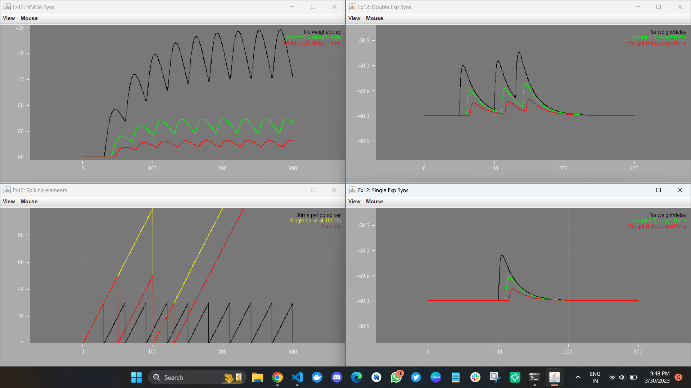

# LEMS model simulation in Local Machine 📃


## LEMS_NML2_Ex12_Net2
## LEMS_NML2_Ex2_Izh

After Reading all the documentations I am able to simluate this models in my local machine
Here are some Steps:


1. You need Clone the Repo 💻
2. First validate your model in order to simulate (It's Important) 🔭

```sh
cd NeuroML model testing 
./jnml -validate MyNeuroML.nml              (validate NeuroML 2 document against the current schema)
./jnml -validatev1 MyNeuroML1.xml           (validate NeuroML v1 document against the v1.8.1 schema)
./jnml MyLEMS.xml                           (parse & simulate a LEMS model using jLEMS)
./jnml MyLEMS.xml -graph                    (generate png of structure of LEMS model using GraphViz)
./jnml MyLEMS.xml -neuron                   (generate code to run on the NEURON simulator)
```
[Refrences](https://github.com/NeuroML/jNeuroML)


## After validating
3. In shell
```sh
.\jnml MyLEMS.xml
```

Example 

```sh
.\jnml LEMS_NML2_Ex12_Net2.xml
```

## Simulation Output LEMS_NML2_Ex12_Net2




## Simulation Output LEMS_NML2_Ex2_Izh


- Robert C. Cannon, Padraig Gleeson, Sharon Crook, Gautham Ganapathy, Boris Marin, Eugenio Piasini and R. Angus Silver, LEMS: A language for expressing complex biological models in concise and hierarchical form and its use in underpinning NeuroML 2
